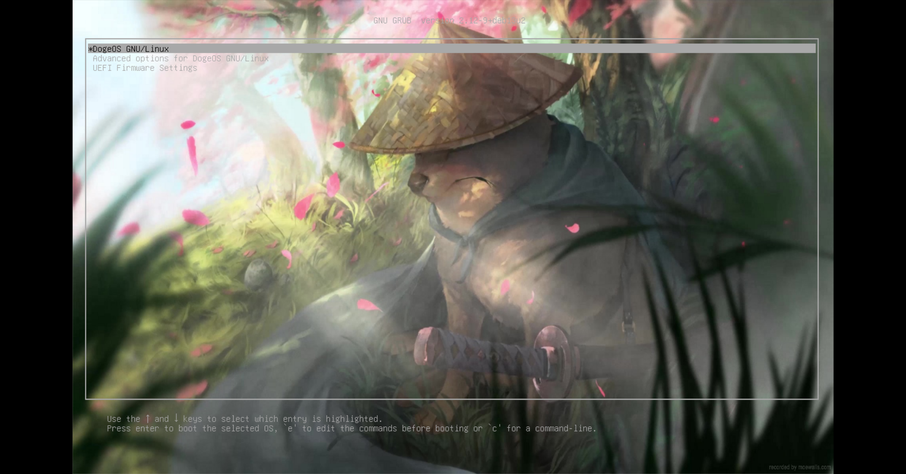
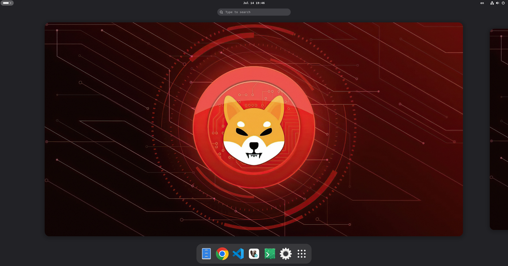
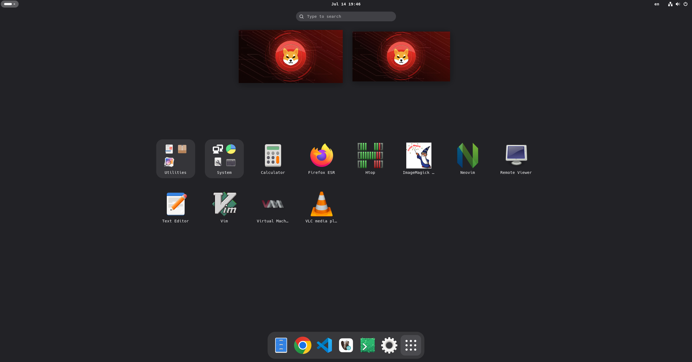
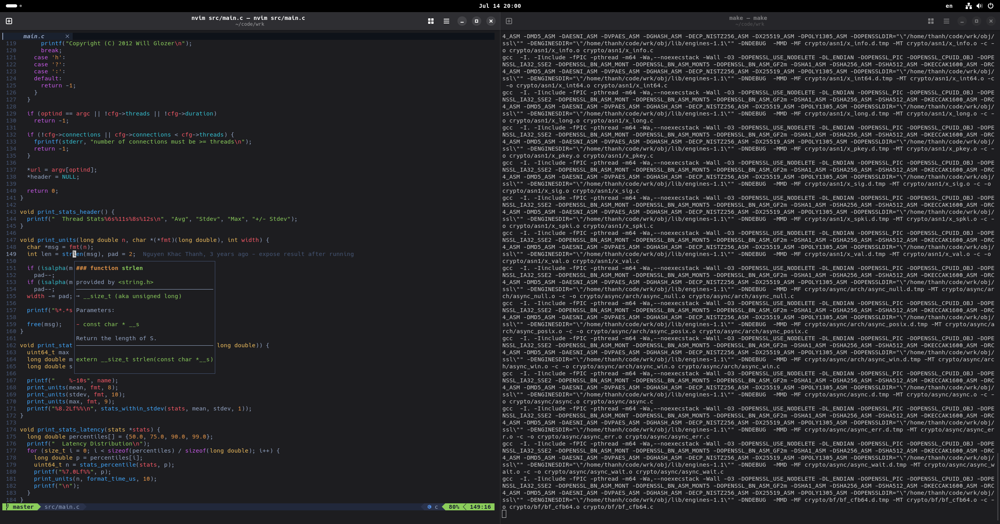
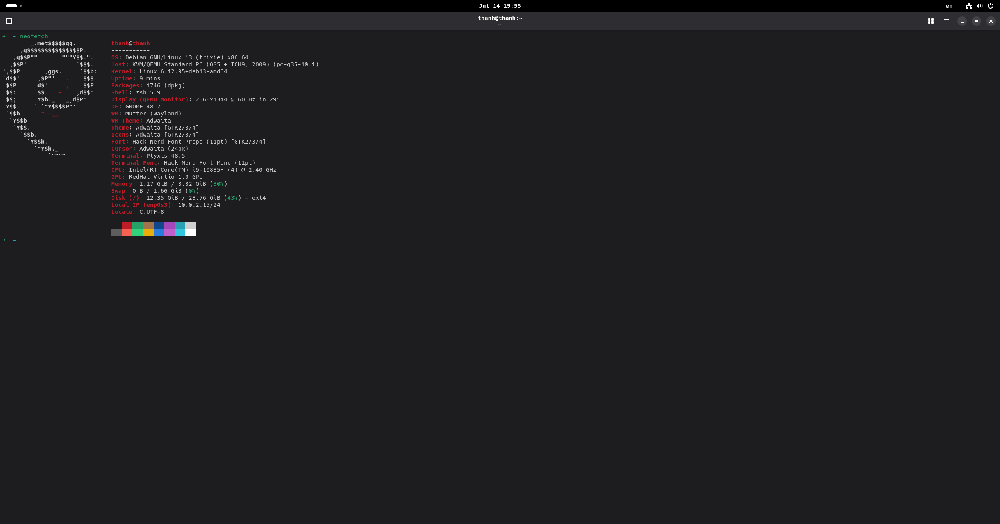
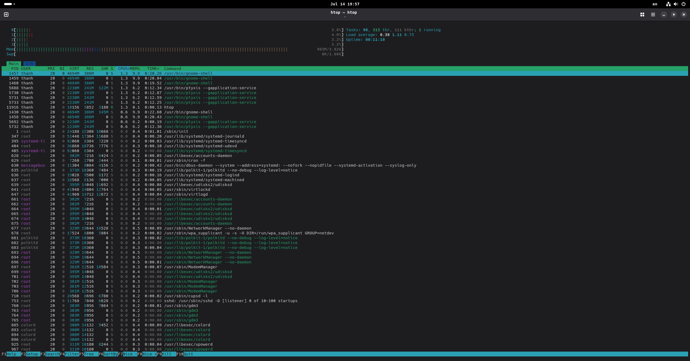

# DogeOS

**DogeOS** is a custom Debian Trixie–based live ISO built for developers. It ships a lean GNOME desktop, a curated toolchain, and Shiba-branded artwork — ready to try from a USB stick or in a VM.

## Screenshots

| Boot | Dashboard |
|:----:|:---------:|
|  |  |

| App menu | Tiling layout |
|:--------:|:-------------:|
|  |  |

| Terminal | Terminal (alt) |
|:--------:|:--------------:|
|  |  |

## Features

- **Debian Trixie (amd64)** hybrid ISO with live session and graphical installer
- **GNOME** desktop with Dash to Dock, AppIndicator, Caffeine, and Tiling Assistant
- **Developer stack** out of the box: Neovim, Git, Podman, Kind, kubectl, Clang, and common CLI utilities (`fzf`, `eza`, `fd`, `ripgrep`, `bat`, `jq`, `yq`)
- **Apps**: Google Chrome, Visual Studio Code, Firefox ESR, DBeaver CE, Virt Manager / QEMU
- **Vietnamese input** via IBus Bamboo
- **Custom branding**: Plymouth splash, GRUB theme, wallpapers, and icons

## Requirements

| Mode | What you need |
|------|----------------|
| **Container build** (default) | [Podman](https://podman.io/) or [Docker](https://www.docker.com/), privileged run support |
| **Native build** | Debian Trixie host with [`live-build`](https://live-team.pages.debian.net/live-manual/) and `fakeroot` |
| **Run in QEMU** | `qemu-system-x86_64`, optional OVMF/UEFI firmware, KVM recommended |

A full ISO build needs disk space for caches and the image (plan for several GB).

## Quick start

```bash
# Build the ISO → output/dogeos-trixie-amd64.hybrid.iso
make build

# Boot it in QEMU (laptop-like profile)
make run

# Remove live-build artifacts and caches
make clean
```

On non-Debian hosts, `make build` uses the container builder under `container-builder/`. On Debian Trixie with `lb` installed, it builds natively and reuses the live-build cache between runs.

### QEMU tips

```bash
# Optional knobs
DOGE_MEMORY=8192 DOGE_SMP=8 make run

# USB Bluetooth / Wi‑Fi passthrough (host device IDs)
DOGE_USB_BT=1 make run
DOGE_USB_WIFI=vvvv:pppp make run
```

SSH into the guest (user networking, port forward):

```bash
ssh -p 2222 live@localhost
```

## Project layout

```
auto/                 live-build config entrypoint
config/               package lists, archives, includes, bootloaders
container-builder/    Containerfile + entrypoint for non-native builds
scripts/              build, run, clean, branding helpers
screenshots/          desktop previews
output/               built ISO (gitignored)
```

Package sets live under `config/package-lists/` (GNOME, standard tools, Chrome, VS Code, etc.). Branding assets are generated from `img/` via `scripts/generate-branding-assets.sh`.

## Contributing

Issues and pull requests are welcome. Prefer small, focused changes: package list tweaks, branding fixes, or build-script improvements with a short note on why.

Before opening a PR:

1. Rebuild with `make build` when touching packages or includes
2. Smoke-test with `make run` if the change affects the live session
3. Keep diffs scoped — avoid unrelated reformatting

## License

Unless otherwise noted in third-party file headers (fonts, themes, upstream packages), project scripts and configuration in this repository are provided as-is for personal and community use. Upstream Debian packages retain their own licenses.
